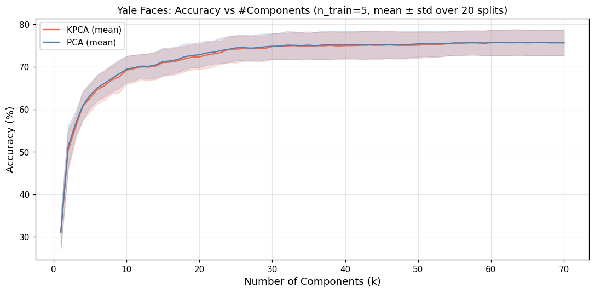
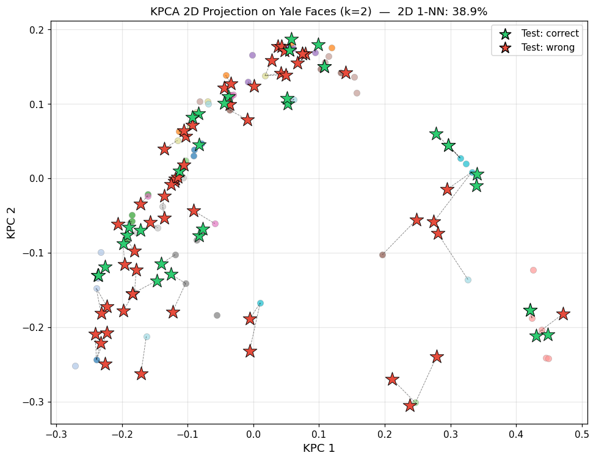
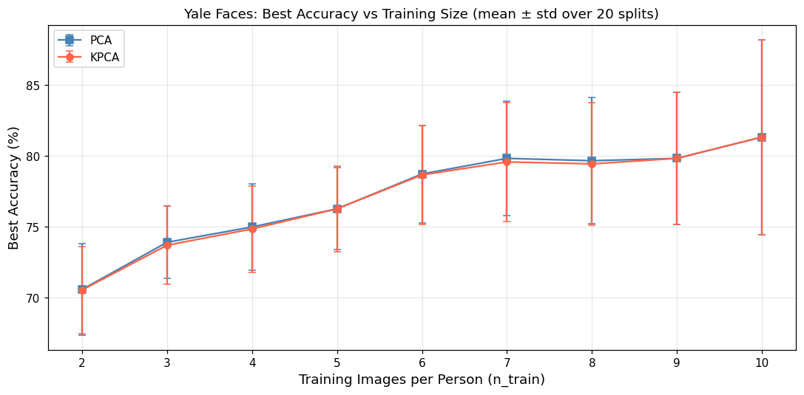
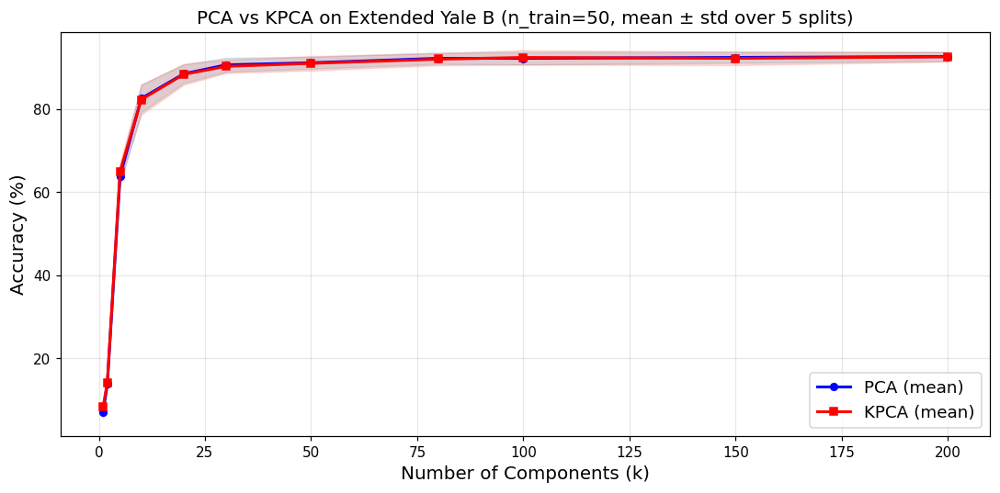
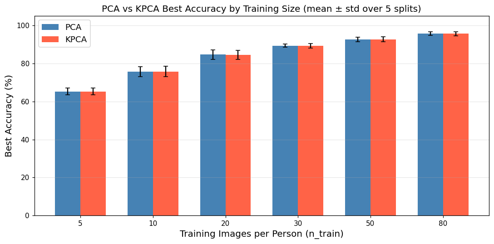
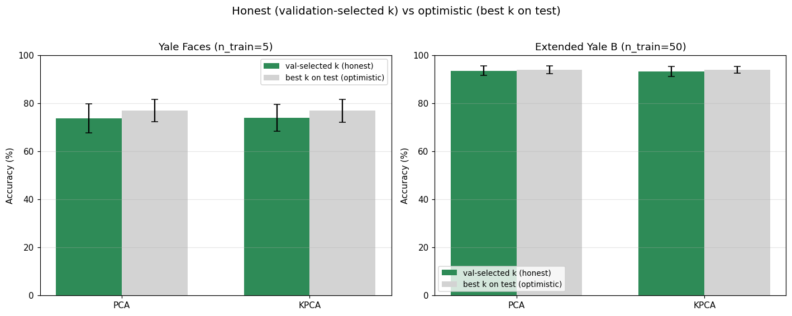
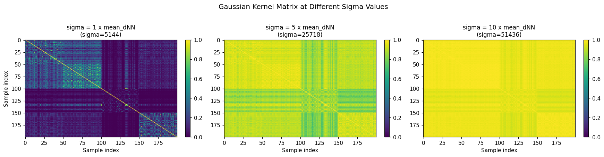

# Kernel Principal Component Analysis for Face Recognition

## 1. Introduction

Principal Component Analysis (PCA) is one of the most widely used techniques for dimensionality reduction in face recognition. By projecting high-dimensional image data onto directions of maximum variance, PCA (also known as "Eigenfaces") provides an efficient low-dimensional representation. However, PCA is inherently limited to capturing **linear** structure in the data. When faces exhibit complex variations due to lighting, pose, or expression, the underlying manifold may be nonlinear, and PCA fails to exploit this structure.

Kernel PCA (KPCA) addresses this limitation by applying the kernel trick: data is implicitly mapped into a high-dimensional feature space via a nonlinear transformation $\phi(x)$, and standard PCA is performed in that space. The key advantage is that the entire computation can be carried out using kernel evaluations $\kappa(x_i, x_j) = \phi(x_i)^T \phi(x_j)$, without ever computing $\phi(x)$ explicitly.

In this report, we implement Kernel PCA with a Gaussian kernel for face recognition, evaluate its performance on two datasets (Yale Faces and Extended Yale B), and compare it directly with standard PCA under identical experimental conditions.

## 2. Method

### 2.1 Kernel PCA

**Motivation.** Standard PCA operates on the covariance matrix $S_x = \frac{1}{N}\sum_i x_i x_i^T$ and finds eigenvectors that capture directions of maximum variance. This is effective when the data lies near a linear subspace, but fails when the meaningful structure is nonlinear — for example, faces under extreme lighting variations may trace out a curved manifold in pixel space that no linear projection can faithfully represent.

Kernel PCA addresses this by first mapping the data through a nonlinear transformation $\phi: \mathbb{R}^D \to \mathbb{R}^M$ (where typically $M \gg D$), and then performing standard PCA in the feature space. The covariance matrix in feature space is:

$$C = \frac{1}{N}\sum_{i=1}^{N} \phi(x_i)\phi(x_i)^T$$

and we seek its eigenvectors $v$ satisfying $Cv = \lambda v$.

**The kernel trick.** Computing $\phi(x_i)$ explicitly is intractable when $M$ is very large (or infinite). The key insight is that the eigenvectors of $C$ can be expressed as linear combinations of the mapped data points:

$$v = \sum_{i=1}^{N} \alpha_i \phi(x_i)$$

Substituting this into the eigenvalue equation and multiplying both sides by $\phi(x_l)^T$, every occurrence of $\phi$ appears only inside inner products $\phi(x_i)^T\phi(x_j)$. We define the kernel function $\kappa(x_i, x_j) = \phi(x_i)^T\phi(x_j)$ and construct the $N \times N$ kernel matrix $K$ with entries $K_{ij} = \kappa(x_i, x_j)$. After algebraic simplification (see Scholkopf et al., 1998 for the full derivation), the problem reduces to an $N \times N$ eigenvalue problem:

$$K \alpha = \lambda N \alpha$$

This is the central result: instead of solving a $D \times D$ (or $M \times M$) eigenvalue problem, we solve an $N \times N$ one — typically much smaller, since the number of training samples $N$ is far less than the feature dimension $D$.

**Choice of kernel.** We use the Gaussian (RBF) kernel:

$$\kappa(x_i, x_j) = \exp\left(-\frac{\|x_i - x_j\|^2}{2\sigma^2}\right)$$

The parameter $\sigma$ controls the kernel width. A small $\sigma$ makes each point interact only with its close neighbors, capturing fine-grained local structure. A large $\sigma$ makes all pairwise kernel values approach 1, and the kernel matrix degenerates toward a linear kernel — in this regime, KPCA reduces to standard PCA.

**Centering.** The derivation above assumes the mapped features have zero mean ($\frac{1}{N}\sum_i \phi(x_i) = 0$). In practice this rarely holds, so we replace $K$ with the centered Gram matrix:

$$\tilde{K} = K - \mathbf{1}_N K - K \mathbf{1}_N + \mathbf{1}_N K \mathbf{1}_N$$

where $\mathbf{1}_N$ is the $N \times N$ matrix with all entries equal to $1/N$.

**Eigendecomposition and projection.** We solve $\tilde{K}\alpha^{(m)} = \lambda_m N \alpha^{(m)}$, sort eigenvalues in descending order, normalize each eigenvector by $1/\sqrt{\lambda_m}$, and discard components with $\lambda_m < 10^{-10}$ (numerical noise). For a test point $x$, its $m$-th kernel principal component is:

$$y_m(x) = \sum_{i=1}^{N} \alpha_i^{(m)} \kappa(x, x_i)$$

after appropriate centering using the training kernel statistics. By retaining only the top $k$ components, we obtain a $k$-dimensional representation for classification.

### 2.2 Parameter Selection

The choice of $\sigma$ critically affects KPCA performance. Following the strategy proposed by Wang (2012), we set $\sigma$ proportional to the mean nearest-neighbor distance:

$$\sigma = 5 \cdot \text{mean}_i(d_i^{NN})$$

where $d_i^{NN}$ is the Euclidean distance from training point $x_i$ to its nearest neighbor. This makes $\sigma$ large enough to connect each point to its neighbors while remaining smaller than typical inter-class distances. Crucially, $\sigma$ is computed from the **training set only**, so it introduces no test-set leakage. We use this $5\times$ rule on both datasets.

An alternative is to grid-search $\sigma$ on the test set; this can inflate the reported accuracy but constitutes data leakage, so we avoid it for $\sigma$.

**Evaluation protocol and its caveats.** For every result below we sweep the number of retained components $k$ and report the *best* test accuracy over that sweep. This is an optimistic upper bound — $k$ is effectively selected on the test set — and a fully rigorous protocol would tune $k$ on a held-out validation split. We retain the sweep because (i) it is applied **identically** to PCA and KPCA, so the head-to-head comparison stays fair, and (ii) the accuracy-vs-$k$ curves are themselves informative. To keep the comparison from resting on a single lucky split, **every reported number is averaged over multiple random train/test splits and reported as mean ± standard deviation** (20 splits on Yale Faces, 5 on Extended Yale B). On Yale Faces we additionally use *all* non-training images as the test set (e.g. 90 test images at $n_{\text{train}}=5$) rather than one image per person, so the estimates are far less noisy than a 15-image split. Absolute numbers should still be read as optimistic (best-$k$) upper bounds.

## 3. Experiments

### 3.1 Datasets

We evaluate KPCA on two face datasets:

| Dataset | Subjects | Images/Subject | Image Size | Features |
|---------|----------|---------------|------------|----------|
| Yale Faces | 15 | 11 | 243 x 320 | 77,760 |
| Extended Yale B | 28 | 576 | 168 x 192 | 32,256 |

The **Yale Faces** dataset contains 15 individuals under varying conditions (lighting, expression, glasses). The **Extended Yale B** dataset contains 28 individuals, each photographed under 576 combinations of illumination and pose, providing a much larger and more controlled dataset.

For both datasets, images are loaded as grayscale, flattened into feature vectors, and split into training and test sets by random selection. On Yale Faces every image not selected for training is used for testing; on Extended Yale B we hold out 10 test images per subject. All experiments are repeated over multiple random splits (fixed seeds for reproducibility) and reported as mean ± std.

### 3.2 KPCA on Yale Faces

Using the Yale Faces dataset with $n_{\text{train}} = 5$ images per person (75 training, **90 test** — all remaining images), averaged over 20 random splits, the auto-selected parameter is $\sigma \approx 47{,}430$ (mean).

**Accuracy vs. number of components.** We sweep the number of components $k$ from 1 up to the number of positive eigenvalues common to all splits ($\approx 70$, split-dependent, out of 75 training samples) and classify with 1-nearest-neighbor (1-NN, Euclidean). Accuracy climbs steeply for the first ~10 components and then plateaus. The peak mean accuracy is **75.7% ± 3.0** for KPCA (around $k \approx 60$) versus **75.8% ± 3.0** for PCA — statistically indistinguishable. (The 86.67% figure from an earlier single 15-image split was an optimistic artifact of that tiny test set; with 90 test images averaged over 20 splits the honest estimate is ~76%.)

*Figure 1. Accuracy vs. number of components on Yale Faces ($n_{\text{train}}=5$), mean ± std over 20 random splits. The PCA and KPCA curves and their std bands overlap throughout — later components add little once the curve plateaus near 75%.*

**2D projection visualization.** Projecting a single split onto the first two KPCA components reveals partial clustering by identity. Training points of the same person tend to group together, and test points (green stars = correct, red stars = wrong) fall near their corresponding clusters; dashed lines show the 1-NN matching. Only 2 of 72 components are used here, so many test points are misclassified — this is an illustration of the embedding, not the full-dimensional accuracy.

*Figure 2. KPCA 2D projection on Yale Faces (k=2, one split). Training points colored by person; test stars colored by classification result. Dashed lines connect each test point to its nearest training neighbor.*

**Effect of training size.** We vary $n_{\text{train}}$ from 2 to 10, averaging over 20 random splits (test set = all remaining images, so it shrinks as $n_{\text{train}}$ grows):

| $n_{\text{train}}$ | Test imgs | PCA (mean ± std) | KPCA (mean ± std) |
|-----|-----|-----------------|------------------|
| 2 | 135 | 70.59 ± 3.22 | 70.56 ± 3.08 |
| 3 | 120 | 73.92 ± 2.56 | 73.71 ± 2.77 |
| 4 | 105 | 75.00 ± 3.04 | 74.86 ± 3.05 |
| 5 | 90 | 76.28 ± 2.88 | 76.28 ± 3.03 |
| 6 | 75 | 78.73 ± 3.44 | 78.67 ± 3.48 |
| 7 | 60 | 79.83 ± 4.01 | 79.58 ± 4.18 |
| 8 | 45 | 79.67 ± 4.46 | 79.44 ± 4.32 |
| 9 | 30 | 79.83 ± 4.65 | 79.83 ± 4.65 |
| 10 | 15 | 81.33 ± 6.86 | 81.33 ± 6.86 |

*Figure 3. Best accuracy vs. training size on Yale Faces, mean ± std over 20 random splits. PCA and KPCA overlap within one std at every training size.*

Accuracy rises smoothly with more training data, and PCA and KPCA agree at every training size — the largest gap (0.25 points) is an order of magnitude smaller than the seed-to-seed std (3–7 points). The std also grows as $n_{\text{train}}$ increases, because the test set shrinks (only 15 images remain at $n_{\text{train}}=10$); averaging over 20 splits keeps the mean stable but cannot fully remove this variance. Either way, there is no measurable KPCA advantage.

### 3.3 PCA vs. KPCA on Extended Yale B

To investigate whether KPCA offers a genuine advantage over standard PCA for face recognition, we conduct a controlled comparison on the larger Extended Yale B dataset.

**Setup.** Both methods use the same train/test splits, the same 1-NN classifier, and sweep over the same range of components; results are averaged over **5 random splits** (mean ± std). For KPCA, $\sigma$ is selected with the auto-sigma strategy at the large-multiplier setting $m=5$ (Wang's recommendation), which — as we show below — pushes the kernel into a near-linear regime on this high-dimensional data.

**Accuracy vs. components ($n_{\text{train}} = 50$).** With 1,400 training and 280 test images per split (mean $\sigma \approx 23{,}283$):

| Components $k$ | PCA | KPCA |
|--------|-------|--------|
| 5 | 63.79 ± 2.05 | 65.00 ± 2.06 |
| 10 | 82.50 ± 3.33 | 82.21 ± 3.58 |
| 50 | 91.07 ± 1.43 | 90.93 ± 1.73 |
| 100 | 92.14 ± 1.50 | 92.36 ± 1.71 |
| 150 | 92.36 ± 1.31 | 92.14 ± 1.64 |
| 200 | **92.57 ± 1.09** | **92.50 ± 1.15** |

*Figure 4. PCA vs. KPCA accuracy on Extended Yale B ($n_{\text{train}}=50$), mean ± std over 5 splits. The two mean curves and their bands overlap across the whole range.*

The best mean accuracies are 92.57% ± 1.09 (PCA) and 92.50% ± 1.15 (KPCA) at $k=200$ — a 0.07-point gap, far inside the ±1.1-point split-to-split variability.

**Across training sizes.** We repeat the comparison for $n_{\text{train}} \in \{5, 10, 20, 30, 50, 80\}$ (mean ± std over 5 splits):

| $n_{\text{train}}$ | PCA | KPCA | \|diff\| |
|-----|-------|--------|--------|
| 5 | 65.29 ± 1.90 | 65.29 ± 1.74 | 0.00 |
| 10 | 75.64 ± 2.56 | 75.79 ± 2.73 | 0.14 |
| 20 | 84.64 ± 2.46 | 84.43 ± 2.38 | 0.21 |
| 30 | 89.36 ± 0.89 | 89.21 ± 1.18 | 0.14 |
| 50 | 92.64 ± 1.12 | 92.71 ± 1.29 | 0.07 |
| 80 | 95.71 ± 0.98 | 95.64 ± 1.09 | 0.07 |

*Figure 5. PCA vs. KPCA best accuracy across training sizes on Extended Yale B, mean ± std over 5 splits. The error bars overlap completely at every training size.*

At every training size the PCA–KPCA gap is $\leq 0.21$ points, while the split-to-split std is $\approx 1$–2.7 points. The difference is therefore statistical noise: neither method has a real edge.

### 3.4 Removing the k-selection bias

The "best accuracy" numbers above select $k$ on the test set, which is optimistic. As a final rigor check we hold out a **disjoint validation set**, choose $k^\*$ on validation, and report accuracy on a separate test set (Yale: 5 train / 3 val / rest test, 20 splits; Extended Yale B: 50 train / 10 val / 10 test, 5 splits). We compare this honest estimate with the optimistic best-on-test:

| Dataset | Method | Honest (val-selected $k$) | Optimistic (best-on-test) |
|---------|--------|--------------------------|---------------------------|
| Yale ($n_{\text{tr}}=5$) | PCA | 73.89 ± 6.04 | 77.00 ± 4.62 |
| | KPCA | 74.00 ± 5.67 | 77.00 ± 4.78 |
| Ext. Yale B ($n_{\text{tr}}=50$) | PCA | 93.64 ± 1.92 | 94.00 ± 1.54 |
| | KPCA | 93.36 ± 2.03 | 93.93 ± 1.39 |

*Figure 6. Validation-selected $k$ (honest) vs. best $k$ chosen on the test set (optimistic), mean ± std. The selection bias is ~3 points on the tiny Yale test set but only ~0.5 points on the larger Extended Yale B test set.*

Two conclusions follow. First, the test-set $k$-selection inflates accuracy by about **3 points on Yale** (small, noisy test set) but only **~0.5 points on Extended Yale B** (larger test set) — so the optimistic numbers elsewhere in this report are mild upper bounds, not gross overstatements. Second, and most importantly, **PCA and KPCA remain statistically indistinguishable under the honest protocol** (73.9 vs 74.0 on Yale; 93.6 vs 93.4 on Extended Yale B, both with gaps far below their std). The central finding survives the stricter evaluation.

## 4. Discussion

### Why is the PCA–KPCA gap so small on these face images?

Averaged over many random splits, PCA and KPCA are **statistically indistinguishable** on both datasets: every PCA–KPCA gap we measured ($\leq 0.3$ points across all protocols, including the validation-based one in Section 3.4) is far smaller than the split-to-split standard deviation ($\approx 1$–7 points), so no gap is significant. This contrasts with Wang (2012), who reported KPCA test error of 11.54% versus PCA's 23.08% on Yale Face Database B. We identify three reasons for this discrepancy:

**High dimensionality relative to sample count.** The Yale Faces images have 77,760 features with at most 150 training samples (dimension-to-sample ratio of ~500:1). The Extended Yale B images have 32,256 features with up to 2,240 training samples (~14:1 at $n_{\text{train}} = 80$). In such high-dimensional spaces, data points are approximately linearly separable regardless of any underlying nonlinear manifold structure. PCA already captures sufficient discriminative information, leaving no room for KPCA to improve.

**Auto-sigma produces large $\sigma$ values.** The $5\times$ rule yields $\sigma$ in the tens of thousands on both datasets — far larger than typical inter-point distances. When $\sigma \gg d$, the Gaussian kernel linearizes:

$$\exp\left(-\frac{d^2}{2\sigma^2}\right) \approx 1 - \frac{d^2}{2\sigma^2}$$

a linear function of the squared distance, so the centered kernel matrix reduces to an (approximately) scaled, centered linear Gram matrix and KPCA degenerates toward standard PCA — explaining the near-identical results. This is the dominant mechanism on Extended Yale B; on Yale Faces the high dimension-to-sample ratio (above) compounds it, so KPCA matches PCA regardless of the exact kernel width.

We verified this by visualizing the kernel matrix at three multipliers:

*Figure 7. Gaussian kernel matrices at σ = 1×, 5×, and 10× the mean nearest-neighbor distance, computed on the first 200 training images (four subjects) for legibility. As the multiplier grows the off-diagonal contrast collapses and the kernel approaches a linear one — the regime in which KPCA reduces to PCA. The 5× panel corresponds to our Extended Yale B setting.*

At $m=1$ the matrix retains clear block structure; by $m=5$–$10$ the off-diagonal contrast is strongly compressed and the matrix approaches a low-contrast, near-rank-one form — the visual signature of an almost-linear kernel. (The entries are *not* literally all $\approx 1$: pairs from different subjects remain visibly smaller. What collapses is the contrast that gives KPCA its nonlinear leverage.) Because this view uses only the first four subjects, it illustrates the trend rather than the full-dataset structure.

**Cropped and aligned images.** Both our datasets contain cropped, aligned face images with minimal background, which removes much of the *spatial* variability (pose, scale, translation) that could create nonlinear manifold structure. One caveat: strong *photometric* variability remains — Extended Yale B is specifically built around extreme illumination changes, and our pipeline applies no intensity normalization (raw pixel values are used). So the data is not free of nonlinear variation; rather, whatever illumination-induced nonlinearity exists is evidently not something a Gaussian kernel at this $\sigma$ can exploit beyond what PCA already captures. Differences in preprocessing (cropping, alignment, normalization) may also partly explain the gap between our results and Wang's.

### When would KPCA outperform PCA?

Based on our analysis, KPCA's nonlinear capacity would be beneficial when:

1. **Feature dimensionality is low** — forcing the data onto a manifold where linear projections lose information.
2. **The data has inherent nonlinear structure** — such as concentric clusters, curved manifolds, or complex pose/lighting interactions that cannot be captured by linear subspaces.
3. **$\sigma$ is small enough** to capture local nonlinear geometry rather than approximating a linear kernel.

The synthetic two-concentric-spheres experiment in Wang (2012) satisfies all three conditions: 3-dimensional features, clear nonlinear structure, and appropriately tuned $\sigma$. Our cropped face images satisfy none of them.

## 5. Conclusion

We implemented Kernel PCA with a Gaussian kernel for face recognition, using the auto-sigma parameter selection strategy from Wang (2012). Experiments on the Yale Faces dataset (15 subjects) and Extended Yale B dataset (28 subjects, 16,128 images) demonstrate that:

1. On Yale Faces ($n_{\text{train}}=5$, 90 test images, 20 splits), KPCA reaches 75.7% ± 3.0 with 1-NN — indistinguishable from PCA's 75.8% ± 3.0.
2. On the larger Extended Yale B dataset, PCA and KPCA are equal across all training sizes (e.g. 92.6% ± 1.1 vs. 92.7% ± 1.3 at $n_{\text{train}}=50$); every gap is $\leq 0.25$ points, far below the $\approx 1$–2.7-point split-to-split standard deviation.
3. This equivalence is explained by the high dimension-to-sample ratio of face image features, compounded by the large auto-selected $\sigma$, which together cause the Gaussian kernel to operate in a near-linear regime.
4. The conclusion is robust to evaluation protocol: with $k$ chosen on a held-out validation set instead of the test set (Section 3.4), absolute accuracy drops modestly (by ~3 points on the small Yale test set, ~0.5 on Extended Yale B) but PCA and KPCA stay statistically indistinguishable.

These findings highlight that KPCA is not universally superior to PCA. Its advantage depends on the data's intrinsic structure and dimensionality. For high-dimensional, cropped face images, standard PCA remains a strong and computationally cheaper baseline.

## References

- Wang, Q. (2012). Kernel Principal Component Analysis and its Applications in Face Recognition and Active Shape Models. *arXiv:1207.3538*.
- Scholkopf, B., Smola, A., & Muller, K.-R. (1998). Nonlinear component analysis as a kernel eigenvalue problem. *Neural Computation*, 10(5), 1299-1319.
- Bishop, C. M. (2006). *Pattern Recognition and Machine Learning*. Springer.
- Georghiades, A. S., Belhumeur, P. N., & Kriegman, D. J. (2001). From few to many: Illumination cone models for face recognition under variable lighting and pose. *IEEE TPAMI*, 23(6), 643-660.
